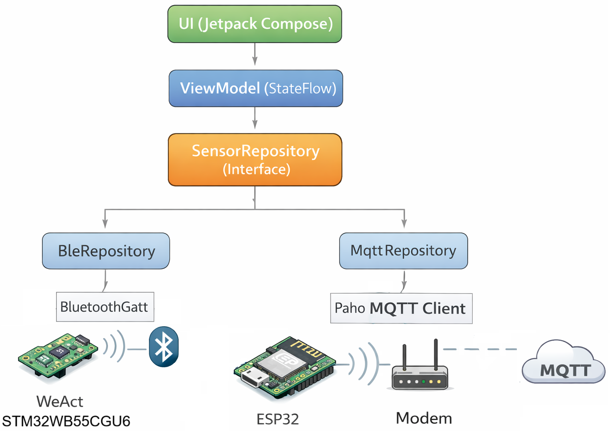
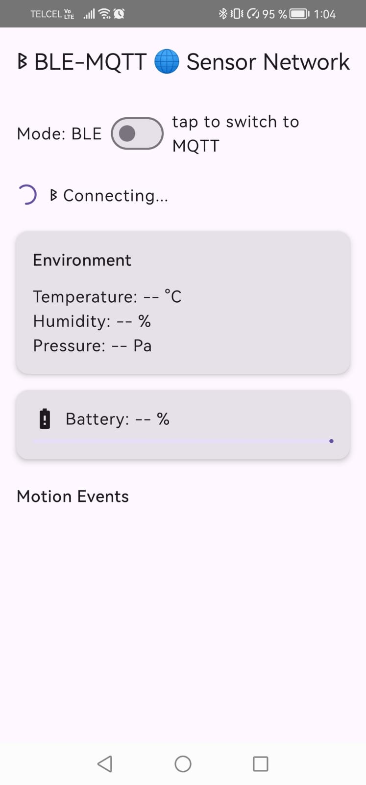
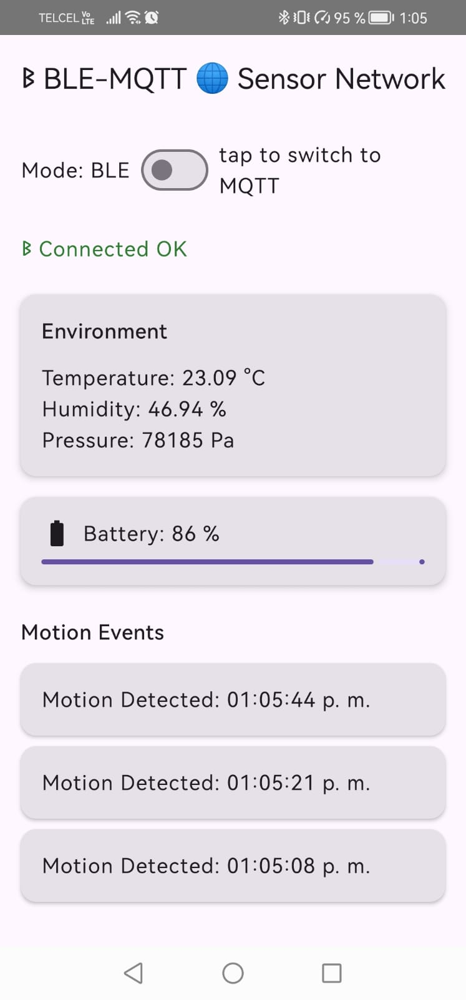
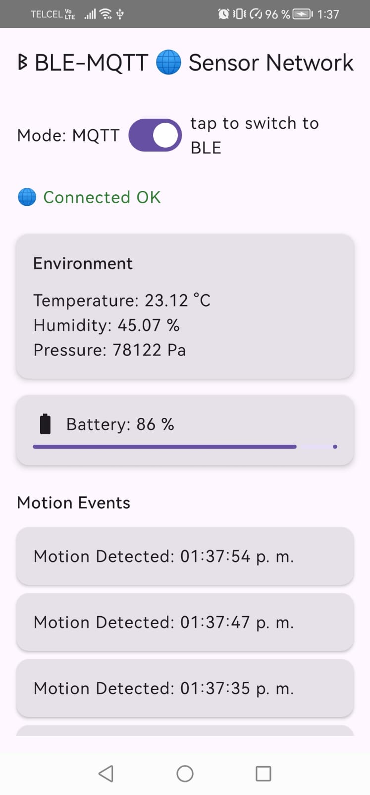

# 📱 Android – STM32WB BLE / MQTT Sensor Network Monitor (Jetpack Compose)

This Android application connects to the STM32WB Sensor Node either:

- 🔵 Directly via BLE
- 🌐 Remotely via MQTT (WebSocket Secure)

It provides real-time monitoring of:

- 🌡 Temperature
- 💧 Humidity
- 🌬 Pressure
- 🔋 Battery level
- 🚨 Motion detection events

The app acts as a mobile monitoring interface for the STM32WB distributed sensor network.

---

# ✨ Features

- 🔍 Automatic BLE scanning (device name filter: STM32WB)
- 🔗 Full GATT connection & notification management
- 🌐 Secure MQTT over WSS (HiveMQ public broker)
- 🔄 Dynamic switching between BLE and MQTT modes
- 📡 Real-time telemetry updates
- 🔋 Dynamic battery level indicator
- 🚨 Motion event log (timestamped)
- 🧩 Clean MVVM architecture
- 💉 Hilt dependency injection
- ⚡ Fully reactive UI (StateFlow + Compose)
- 🧠 Flow-based transport abstraction (BLE & MQTT interchangeable)

---

# 🏗️ Architecture Overview

<p align="center">
  
  <br>
  <em>App Architecture</em>
</p>

The application dynamically switches repository implementation depending on the selected connection mode.

---

# 🔄 Dual Communication Design

The app supports two independent transport layers:

## 🔵 BLE Mode

- Scans for devices containing `"STM32WB"`
- Connects via BluetoothGatt
- Discovers custom service
- Enables CCCD notifications sequentially
- Parses raw characteristic payloads
- Maps byte arrays → SensorData domain model

## 🌐 MQTT Mode

- Broker:  
  `"wss://broker.hivemq.com:8884/mqtt"`
- Protocol: WebSocket Secure (TLS)
- Auto-reconnect enabled
- Subscribes to:
  gateway/sensor/#

Topic-based decoding:

- .../temperature → Float
- .../humidity → Float
- .../pressure → Int
- .../battery → Int
- .../motion → MotionEvent

---

# 📂 Project Structure

```bash
stm32wb/
│
├── data/
│   ├── ble/
│   │   ├── BleEvent.kt
│   │   ├── BleManager.kt
│   │   └── BleRepositoryImpl.kt
│   │
│   └── mqtt/
│       └── MqttRepositoryImpl.kt
├── di/
│   └── AppModule.kt
│
├── domain/
│   ├── model/
│   │   ├── ConnectionState.kt
│   │   └── SensorData.kt
│   │
│   └── repository/
│       └── SensorRepository.kt (interface)
│
├── ui/
│   ├── navigation/
│   │   ├── AppNavGraph.kt
│   │   └── NavRoutes.kt
│   │
│   ├── permission/
│   │   └── PermissionScreen.kt
│   │
│   └── sensor/
│       ├── ConnectionMode.kt
│       ├── SensorScreen.kt
│       └── SensorViewModel.kt
│
├── MainActivity.kt
└── SensorApp.kt
```


---

# 🔵 BLE Configuration

| Parameter           | Value                                |
|---------------------|--------------------------------------|
| Custom Service UUID | 0000A000-0000-1000-8000-00805f9b34fb |
| Temperature UUID    | 0000A001-0000-1000-8000-00805f9b34fb |
| Humidity UUID       | 0000A002-0000-1000-8000-00805f9b34fb |
| Pressure UUID       | 0000A003-0000-1000-8000-00805f9b34fb |
| Motion UUID         | 0000A004-0000-1000-8000-00805f9b34fb |
| Battery UUID        | 00002A19-0000-1000-8000-00805f9b34fb |
| CCCD                | 0x2902                               |

Notifications are enabled sequentially to avoid descriptor write collisions.

---

# 🧠 Data Model

```bash
data class SensorData(
val temperature: Float? = null,
val humidity: Float? = null,
val pressure: Int? = null,
val battery: Int? = null
)

data class MotionEvent(
val timestamp: String
)
```

All UI state is exposed via StateFlow from the ViewModel.

---

# 🔌 Connection State Machine

The UI reacts to a sealed ConnectionState:

- Idle
- ConnectingBle
- ConnectingMqtt
- BleConnected
- MqttConnected
- BleDisconnected
- MqttDisconnected
- Error(message)

This ensures deterministic UI updates and clean state transitions.

---

# 🔐 Permissions

## Android 12+

- BLUETOOTH_SCAN
- BLUETOOTH_CONNECT

## Below Android 12

- ACCESS_FINE_LOCATION

Permissions are requested dynamically at runtime via Compose.

---

# ⚙️ Key Technical Decisions

## 1️⃣ Repository Abstraction

Both BLE and MQTT implement:

SensorRepository

This allows:

- Hot transport switching
- No UI changes
- Clean separation of transport logic

---

## 2️⃣ Flow-based BLE Design

BLE uses:

- callbackFlow
- Sealed BleEvent
- Descriptor write queue
- Structured concurrency
- Automatic resource cleanup in awaitClose

This prevents:

- Memory leaks
- Descriptor write race conditions
- Lost notifications

---

## 3️⃣ Coroutine Job Management

When switching modes:

- Existing collectors are canceled
- Previous repository disconnects
- New repository starts cleanly

Ensures:

- No duplicated flows
- No stale connections
- No cross-transport leaks

---

# ▶️ How to Run

Clone the repository:

```bash
git clone https://github.com/JavierRiv0826/STM32WB-RTOS-BLE5-LowPower-Sensor-ESP32-Network-MQTT.git
```

1. Open in Android Studio
2. Connect a physical Android device (BLE requires real hardware)
3. Grant permissions
4. Power STM32WB sensor node (BLE mode)
5. Power Gateway node (MQTT mode)
6. Observe real-time telemetry

---

# 🧪 Testing Modes

## BLE Test

- Enable Bluetooth
- Ensure STM32WB node is advertising
- Observe automatic connection
- Verify environmental data updates

## MQTT Test

- Run gateway publishing to:
  gateway/sensor/#
- Disable Bluetooth (optional)
- Switch to MQTT mode
- Verify remote updates

---

# ⚠️ Security Note

Current implementation:

- No enforced BLE bonding
- Public MQTT broker
- No authentication layer

For production deployment:

- Enable BLE pairing & encryption
- Use authenticated MQTT broker
- Add TLS certificates
- Add device filtering / whitelisting

---

# 📸 Screenshots

<p align="center">
  
  <br>
  <em>BLE Mode connecting</em>
</p>

<p align="center">
  
  <br>
  <em>BLE Mode</em>
</p>

<p align="center">
  
  <br>
  <em>MQTT Mode</em>
</p>

---

# 🚀 Engineering Value Demonstrated

This project demonstrates:

- Full-stack embedded system integration
- BLE GATT protocol-level handling
- MQTT over TLS integration
- Transport abstraction design
- Reactive mobile architecture
- Concurrency-safe state management
- Clean separation of concerns
- Real-world IoT topology flexibility

This is a system-level embedded project.

---

## 👤 Author

Javier Rivera  
GitHub: JavierRiv0826

---

## 🚀 Project Context

This Android app is part of a complete embedded system including:

- STM32WB Sensor Node (FreeRTOS + BLE)
- ESP32 Gateway Node (BLE → MQTT bridge)
- Python BLE Monitor Tool
- Android Monitoring App

It demonstrates full-stack embedded connectivity from low-power firmware to mobile application.
