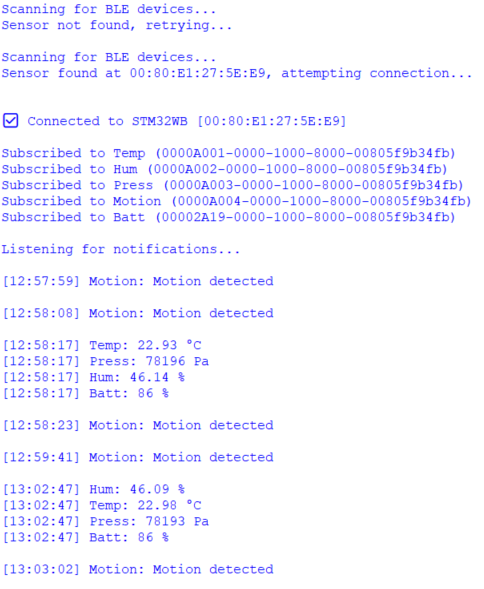
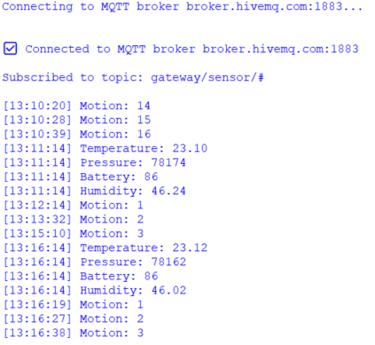

# 🐍 Python Monitoring Toolkit

Desktop monitoring and validation tools for the STM32WB Sensor Node + ESP32 BLE–MQTT Gateway system.

This toolkit provides two independent Python applications:

- 🔵 **BLE Monitor** → Sensor node-level validation
- 🟢 **MQTT Monitor** → Cloud-level validation

Together, they enable full-stack testing of the distributed embedded system:

Sensor Node → BLE → ESP32 Gateway → WiFi → MQTT Broker

---

# 🧩 System Context

The Python tools are used for validation of the following architecture:

```bash
STM32WB Sensor Node (BLE Peripheral)
│
│ BLE Notifications / Indications
▼
ESP32 Gateway (BLE Central)
│
│ WiFi
▼
MQTT Broker (HiveMQ)
│
▼
Python MQTT Monitor
```

The BLE Monitor connects directly to the STM32WB node.  
The MQTT Monitor connects to the MQTT broker to validate end-to-end propagation.

---

# 🔵 Tool 1 — BLE Monitor (Sensor Node-Level Testing)

`ble_monitor.py`

This tool connects directly to the STM32WB BLE Sensor Node and subscribes to its characteristics.

Used to validate:

- ✔ BLE framing
- ✔ GATT characteristic notifications
- ✔ Environmental data formatting
- ✔ Motion indication behavior
- ✔ Battery reporting
- ✔ BLE reconnection handling

---

## 🚀 Features

- BLE 5.0 communication using **Bleak**
- Automatic device discovery (filters by name "STM32WB")
- Asyncio-based event loop
- Automatic reconnection on link loss
- Real-time timestamped telemetry
- Byte-level decoding of sensor values
- Characteristic-specific parsing logic

---

## 📡 BLE Configuration

| Parameter          | Value                                |
|--------------------|--------------------------------------|
| Device Name Filter | STM32WB                              |
| Temperature UUID   | 0000A001-0000-1000-8000-00805f9b34fb |
| Humidity UUID      | 0000A002-0000-1000-8000-00805f9b34fb |
| Pressure UUID      | 0000A003-0000-1000-8000-00805f9b34fb |
| Motion UUID        | 0000A004-0000-1000-8000-00805f9b34fb |
| Battery UUID       | 00002A19-0000-1000-8000-00805f9b34fb |

---

## 📦 Supported Data Types

### 🌡 Temperature
- int16
- Little-endian
- Scaling: °C ×100

### 💧 Humidity
- uint16
- Scaling: % ×100

### 🌬 Pressure
- uint32
- Unit: Pa

### 🕵 Motion
- Event-based notification
- Printed as "Motion detected"

### 🔋 Battery
- uint8
- Unit: %

---

## 💡 How It Works

- Scans every 5 seconds for a device named "STM32WB"
- Connects automatically when found
- Subscribes to all sensor characteristics
- Parses notifications in real time
- Automatically retries connection on failure

---

## ▶ How to Run (BLE Tool)

### 1️⃣ Install Dependencies

```bash
pip install bleak
```

### 2️⃣ Run

```bash
python ble_monitor.py
```

You will see live timestamped telemetry:

```bash
[12:45:02] Temp: 23.45 °C
[12:45:02] Hum: 45.21 %
[12:45:02] Press: 100845 Pa
[12:45:10] Motion: Motion detected
[12:45:15] Batt: 89 %
```

---

# 🟢 Tool 2 — MQTT Monitor (Cloud-Level Testing)

`mqtt_monitor.py`

This tool connects to the MQTT broker and subscribes to all gateway sensor topics.

Used to validate:

- ✔ MQTT topic structure
- ✔ Broker connectivity
- ✔ Gateway publish logic
- ✔ End-to-end data propagation
- ✔ System reliability over WiFi
- ✔ QoS behavior

---

## 🚀 Features

- MQTT client using **paho-mqtt**
- Automatic subscription to wildcard topic
- Real-time timestamped output
- Clean topic parsing
- Lightweight console-based monitor
- Broker-agnostic (configurable)

---

## ☁ MQTT Configuration

| Parameter | Value                                     |
|-----------|-------------------------------------------|
| Broker    | broker.hivemq.com                         |
| Port      | 1883                                      |
| Topic     | gateway/sensor/#                          |
| QoS       | Defined by publisher (Gateway uses QoS 1) |

---

## 📡 Subscribed Topics

```bash
gateway/sensor/temperature
gateway/sensor/humidity
gateway/sensor/pressure
gateway/sensor/motion
gateway/sensor/battery
```

Each message is printed with timestamp:

```bash
[12:52:10] Temperature: 23.45
[12:52:10] Humidity: 45.21
[12:52:10] Pressure: 100845
[12:52:18] Motion: 1
[12:53:01] Battery: 89
```

---

## ▶ How to Run (MQTT Tool)

### 1️⃣ Install Dependencies

```bash
pip install paho-mqtt
```

### 2️⃣ Run

```bash
python mqtt_monitor.py
```

---

# 🏗 Validation Strategy

These two tools allow layered system validation:

### 🔹 BLE-Level Testing
Validates:
- Sensor node firmware
- GATT service implementation
- Characteristic encoding
- BLE stability

### 🔹 Gateway-Level Testing
Validates:
- BLE → MQTT bridging
- Event-driven publish logic
- Topic routing
- QoS reliability

### 🔹 End-to-End Testing
Validates:
Sensor → BLE → Gateway → WiFi → MQTT → Desktop

---

# 🧰 Requirements

- Python 3.8+
- Windows / Linux / macOS
- BLE hardware support (for BLE tool)
- Internet connection (for MQTT tool)

Install all dependencies:

```bash
pip install bleak paho-mqtt
```

---
## 📸 Screenshots

### 🔍 ble_monitor.py

<p align="center">
  
  <br>
  <em>ble_monitor</em>
</p>

### 🔍 mqtt_monitor.py

<p align="center">
  
  <br>
  <em>mqtt_monitor</em>
</p>

---

# 🔐 Security Note ⚠️

Current configuration:

- Public MQTT broker
- No TLS
- BLE without enforced pairing
- No authentication layer

For production deployment:

- Enable MQTT over TLS (port 8883)
- Use broker authentication
- Enable BLE pairing & bonding
- Add application-layer message validation

---

# 🧠 Engineering Highlights

- Async BLE monitoring using asyncio
- Automatic reconnection strategies
- Clean characteristic-based parsing
- Topic wildcard subscription
- End-to-end IoT system observability
- Layered validation methodology
- Lightweight but production-style architecture separation

---

# 👨‍💻 Author

Javier Rivera  
GitHub: JavierRiv0826
